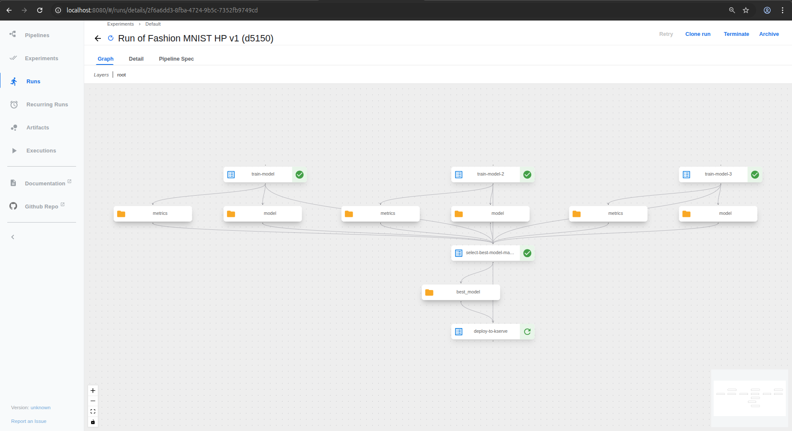

# Fashion MNIST Kubeflow Pipeline with KServe Deployment

This project implements an end-to-end machine learning pipeline using Kubeflow Pipelines to train, evaluate, and deploy a Fashion MNIST classification model. The pipeline trains multiple models with different hyperparameters, automatically selects the best performing model, and deploys it as a scalable inference service using KServe.

## 🎯 Project Aim

The primary goal of this project is to demonstrate a complete MLOps workflow on Kubernetes using Kubeflow:

1. **Parallel Model Training**: Train multiple neural network models simultaneously with different learning rates
2. **Hyperparameter Optimization**: Compare model performance across different configurations
3. **Automated Model Selection**: Select the best model based on validation accuracy
4. **Production Deployment**: Automatically deploy the selected model to KServe for scalable inference
5. **Model Serving**: Provide REST API endpoints for real-time predictions

The pipeline specifically focuses on the Fashion MNIST dataset, which consists of 70,000 grayscale images of fashion items categorized into 10 classes (T-shirt/top, Trouser, Pullover, Dress, Coat, Sandal, Shirt, Sneaker, Bag, Ankle boot).

## 📁 Project Structure

```
kubeflow/
├── README.md                          # This file - project overview and usage
├── requirements.txt                   # Python dependencies
├── compile-pipeline.py                # Script to compile the pipeline
├── fashion-mnist-pipeline-k8s.yaml    # Compiled Kubernetes manifest
├── train.py                           # Main training script (runs from root in container)
├── components/                        # Pipeline components
│   ├── train_component.py            # Training component definition
│   ├── select_best_model.py          # Model selection component
│   └── deploy_to_kserve.py           # KServe deployment component
├── docker/                            # Docker configuration
│   └── Dockerfile                    # Training container image
├── kserve/                           # KServe configuration
│   ├── inference-service.yaml        # InferenceService manifest
│   ├── minio-secret.yaml             # MinIO credentials
│   └── rbac.yaml                     # RBAC permissions
├── pipeline/                         # Pipeline definitions
│   └── pipeline.py                   # Main pipeline definition
└── test/                             # Testing utilities
    └── test_inference.py             # Inference testing script
```

## 🚀 Prerequisites

### Required Software
- **Kubernetes Cluster**: Version 1.34+ with cluster-admin access
- **Kubeflow**: Latest version from official documentation
- **KServe**: Latest version (comes with Knative)
- **MinIO**: Object storage for model artifacts
- **kubectl**: Configured to access your cluster
- **Python**: Version 3.11+ with conda environment

### Python Environment Setup
```bash
# Create and activate conda environment
conda create -n kubeflow python=3.11
conda activate kubeflow

# Install required packages
pip install -r requirements.txt
```

### Cluster Requirements
- **Kubeflow Pipelines**: For workflow orchestration (packaged with Kubeflow)
- **KServe**: For model serving with auto-scaling (comes with Knative)
- **MinIO**: For storing trained models and artifacts

## 📋 How to Use

### 1. Build the Training Image

```bash
# Navigate to docker directory
cd docker

# Build the Docker image
docker build -t kubeflow-fashion-mnist:1.0 .

# Push to your registry (if using external registry)
docker tag kubeflow-fashion-mnist:1.0 <your-registry>/kubeflow-fashion-mnist:1.0
docker push <your-registry>/kubeflow-fashion-mnist:1.0
```

### 2. Configure KServe Prerequisites

```bash
# Apply RBAC permissions
kubectl apply -f kserve/rbac.yaml

# Apply MinIO secret (update credentials if needed)
kubectl apply -f kserve/minio-secret.yaml
```

### 3. Compile the Pipeline

```bash
# Activate conda environment
conda activate kubeflow

# Compile the pipeline
python compile-pipeline.py
```

This creates `fashion-mnist-pipeline-k8s.yaml`.

### 4. Deploy the Pipeline

```bash
# Deploy to Kubernetes
kubectl apply -f fashion-mnist-pipeline-k8s.yaml

# Verify deployment
kubectl get pipelines -n kubeflow
kubectl get pipelineversions -n kubeflow
```

### 5. Run the Pipeline

1. **Access Kubeflow UI**: Open your Kubeflow dashboard
2. **Navigate to Pipelines**: Go to the Pipelines section
3. **Find the Pipeline**: Look for "fashion-mnist-hyperparameter-pipeline"
4. **Create Experiment**: Click "Create Run"
5. **Configure Parameters**:
   - `epochs`: Number of training epochs (default: 5)
   - `hidden_units`: Number of neurons in hidden layer (default: 128)
6. **Start Pipeline**: Click "Start" to begin execution

### 6. Monitor and Verify

```bash
# Check pipeline runs
kubectl get pipelineruns -n kubeflow

# Monitor KServe deployment
kubectl get inferenceservices -n kubeflow

# Check model serving pods
kubectl get pods -n kubeflow -l serving.kserve.io/inferenceservice=fashion-mnist-model
```

### 7. Test the Deployed Model

```bash
# Set up port forwarding for testing
POD_NAME=$(kubectl get pods -n kubeflow -l serving.kserve.io/inferenceservice=fashion-mnist-model -o jsonpath='{.items[0].metadata.name}')
kubectl port-forward -n kubeflow $POD_NAME 8080:8080 &

# Run the test script
python test/test_inference.py
```

## 🔧 Pipeline Configuration

### Hyperparameters
- **Learning Rates**: [0.001, 0.0005, 0.0001] (fixed in pipeline)
- **Epochs**: Configurable (default: 5)
- **Hidden Units**: Configurable (default: 128)
- **Model Architecture**: Simple neural network with one hidden layer

### Model Selection Criteria
- **Primary Metric**: Validation accuracy
- **Selection Method**: Highest accuracy among the three trained models

### Deployment Configuration
- **Service Name**: fashion-mnist-model
- **Namespace**: kubeflow
- **Min Replicas**: 1
- **Max Replicas**: 3
- **Scale Metric**: Concurrency (1 concurrent request per pod)

## 📊 Pipeline Flow

```
┌─────────────────┐    ┌─────────────────┐    ┌─────────────────┐
│   Train Model   │    │   Train Model   │    │   Train Model   │
│   (lr=0.001)    │    │   (lr=0.0005)   │    │   (lr=0.0001)   │
└─────────┬───────┘    └─────────┬───────┘    └─────────┬───────┘
          │                     │                     │
          └─────────────────────┼─────────────────────┘
                                │
                   ┌────────────▼────────────┐
                   │   Select Best Model     │
                   │   (Based on Accuracy)   │
                   └────────────┬────────────┘
                                │
                   ┌────────────▼────────────┐
                   │   Deploy to KServe      │
                   │   (Auto-deployment)     │
                   └─────────────────────────┘
```



## 🧪 Testing and Validation

### Automated Testing
The project includes comprehensive testing utilities:

- **`test/test_inference.py`**: Automated inference testing with visualization
- **`fix_model_structure.py`**: Utility to fix model directory structure issues

### Manual Testing
```bash
# Get service endpoint
kubectl get inferenceservice fashion-mnist-model -n kubeflow -o jsonpath='{.status.url}'

# Send prediction request
curl -X POST http://localhost:8080/v1/models/fashion-mnist-model:predict \
  -H "Content-Type: application/json" \
  -d '{"instances": [[0.0, 0.0, ..., 0.0]]}'  # 784 values for 28x28 image
```

## 🐛 Troubleshooting

### Common Issues

1. **Pipeline Compilation Fails**
   ```bash
   # Ensure KFP is installed
   pip install kfp==2.15.2
   ```

2. **Docker Image Not Found**
   ```bash
   # Verify image exists
   docker images | grep kubeflow-fashion-mnist
   ```

3. **KServe Deployment Fails**
   ```bash
   # Check RBAC and secrets
   kubectl get clusterrolebinding pipeline-kserve-deployer-binding
   kubectl get secret minio-s3-secret -n kubeflow
   ```

4. **Model Not Loading**
   ```bash
   # Check pod logs
   kubectl logs -n kubeflow -l serving.kserve.io/inferenceservice=fashion-mnist-model -c kserve-container
   ```

For detailed troubleshooting, see [`KSERVE_DEPLOYMENT_GUIDE.md`](KSERVE_DEPLOYMENT_GUIDE.md).

## 📈 Performance and Scaling

- **Training Time**: ~2-3 minutes per model (depending on epochs)
- **Concurrent Requests**: Scales from 1 to 3 pods based on load
- **Resource Usage**: 500m CPU request, 1Gi memory request per pod
- **Model Size**: ~1-2MB for saved TensorFlow model

## 🤝 Contributing

1. Fork the repository
2. Create a feature branch
3. Make your changes
4. Test thoroughly
5. Submit a pull request

## 📄 License

This project is licensed under the MIT License - see the [LICENSE](LICENSE) file for details.

## 📚 Additional Resources

- [Kubeflow Documentation](https://www.kubeflow.org/)
- [KServe Documentation](https://kserve.github.io/website/)
- [Fashion MNIST Dataset](https://github.com/zalandoresearch/fashion-mnist)
- [TensorFlow Serving](https://www.tensorflow.org/tfx/guide/serving)
- [KSERVE_DEPLOYMENT_GUIDE.md](KSERVE_DEPLOYMENT_GUIDE.md) - Comprehensive KServe deployment guide

## 🎯 Key Features Summary

✅ **Parallel Training**: Train multiple models simultaneously  
✅ **Hyperparameter Tuning**: Compare different learning rates  
✅ **Automated Selection**: Best model chosen by accuracy  
✅ **Production Deployment**: KServe with auto-scaling  
✅ **REST API**: Ready for real-time inference  
✅ **Monitoring**: Built-in metrics and logging  
✅ **Scalability**: Kubernetes-native scaling  

This project serves as a complete template for MLOps workflows on Kubeflow, demonstrating best practices for model training, evaluation, and deployment in production environments.